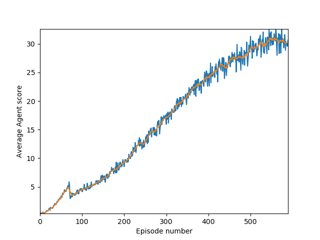

# Continuous Control Report
This is the report for my submission for the Udacity Continuous Control Nanodegree project.
Here I will describe the algorithms and details of how I solved this problem.

This report specifically focuses on the case of the problem using multiple agents in the same sim, however the algorithm should work for the single agent case.
This will however take much longer to train.

## Algorithm
This project implements the [PPO algorithm](https://openai.com/blog/openai-baselines-ppo/).
It is a policy gradient algorithm that is based on [TRPO](https://arxiv.org/abs/1502.05477) but is designed to be much simpler and have fewer hyperparameters.
My algorithm uses an actor critic architecture where the actor and critic are trained separately. 
The surrogate used is the clipped gradient with a small entropy term added.
The actor outputs the means and standard deviations of a multivariate normal which can then be sampled to get actions.


## Details
```python
# Actor
state_size = 33
action_size = 4 
layer1_size = 256 # shared between means and std outputs
layer2_size = 128 # means and stds each have their own second layer

# Critic
import torch.nn as nn
critic = nn.Sequential(
    nn.Linear(state_size, 32),
    nn.Tanh(),
    nn.Linear(32, 16),
    nn.Tanh(),
    nn.Linear(16, 1),
)
# Surrogate
surr = -(min(clipped_surrogate, norrmal_surrogate) + 0.07 * entropy)

# Hyperparameters
num_epochs = 80
clipping_epsilon = 0.2
optimizer = Adam(lr=0.0006, betas=(0.9, 0.999))
num_rollouts_before_training = 1 # 1000 * 20 timesteps of data
gamma = 0.99
```

## Results

My agent solved the challenge in 490 episodes. 
Here are the results:


The solved agents weights are in the files `saved_actor.pth` and `saved_critic.pth`.

## Future work
I was not overly impressed by the performance of PPO even though I did a fair amount of hyperparameter tuning.
I'd like to implement the [DDPG algorithm](https://spinningup.openai.com/en/latest/algorithms/ddpg.html) next to compare 
its performance.
Currently the user can select ddpg as a training option in the script but it is not implemented. 

Another possibility with this work is to combine the layers of the critic and the actor. 
They curently share no layers and I would intuitively expect this to waste effort learning similar representations of 
the important features of the state space.
Combining the actor and critic in the same network may help this although introduces the complexity of having to factor
in the critic loss function into the surrogate.